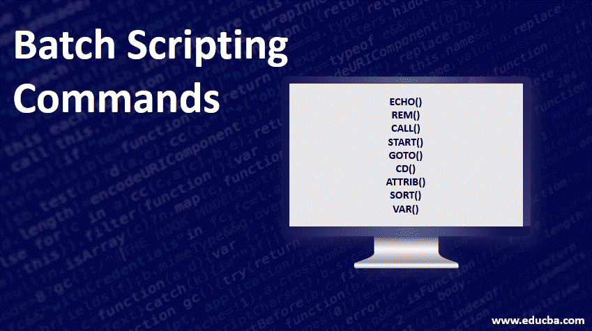

# Batch Scripting Basic Fundamentals

## Introduction

This repository contains scripts that explains the basic fundamentals of Batch programming and CMD. This is very useful for beginner to learn basic automation and scripting in Batch.

Batch programming is a scripting paradigm that can execute certain commands automatically at the level of an operating system such as DOS or Windows 7 / XP. A batch file is a stack of such commands. If it is retrieved with the command line, the system will execute each task listed in succession.

This scripts are based on a YouTube tutorial that was posted as playlist at GR Tech School Channel.

* Batch Playlist: https://www.youtube.com/playlist?list=PLk4mEzA6dvTJaXd4GEp_CVMpjWauGWdKY

Any Questions? | Conduct Me
---

* [Linkedin Profile](https://www.linkedin.com/in/gunarakulangunaretnam)
* [Facebook Profile](https://www.facebook.com/gunarakulan)
* [Twitter Profile](https://twitter.com/gunarakulang)
* [Instagram Profile](https://www.instagram.com/gunarakulan_gunaretnam/)
* [Youtube Channel](https://www.youtube.com/channel/UCMWkED5sabgVZSCKjZuRJXA/videos)
